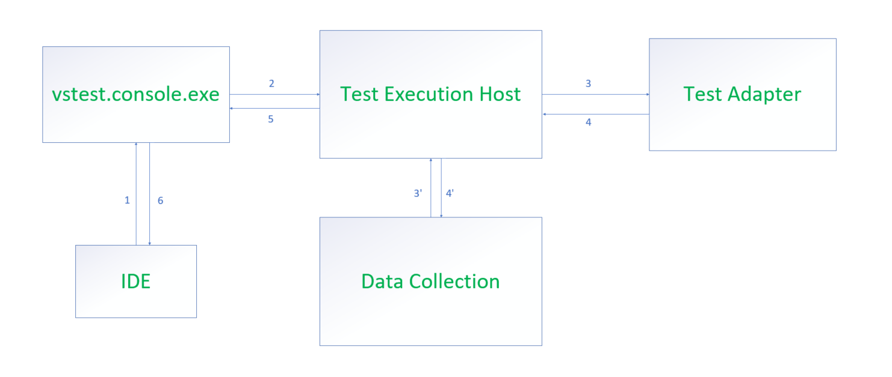

# Getting Started With Test Platform

## What is Test Platform?

``Visual Studio Test Platform (TP)`` - is a platform which allows you to write, execute and debug tests inside your testing project. Additionally TP is the runner and engine that powers test explorer and vstest.console.
Which means that you can run your tests in [Test Explorer](https://docs.microsoft.com/en-us/visualstudio/test/run-unit-tests-with-test-explorer?view=vs-2019) inside Visual Studio as well as with the help of [vstest.console.exe](https://docs.microsoft.com/en-us/visualstudio/test/vstest-console-options?view=vs-2019) and [dotnet test](https://docs.microsoft.com/en-us/dotnet/core/tools/dotnet-test) commands in terminal and in you CI/CD piplines in Azure DevOps.

## Which functionality provided by Test Platform?

1. Run tests from the specified files.
2. Target platform architecture to be used for test execution.
3. Target .NET version to be used for test execution.
4. Filter tests based on some expression.
5. Enable logging during the execution.
6. [Code Coverage](https://docs.microsoft.com/en-us/visualstudio/test/using-code-coverage-to-determine-how-much-code-is-being-tested?view=vs-2019) - determine what proportion of your project's code is actually being tested by available tests.

All available options and examples can be found [here](https://docs.microsoft.com/en-us/visualstudio/test/vstest-console-options?view=vs-2019).

## High level design of Test Platform

Before starting discussion about high level architecture, let's look at some terminology which commonly used in Test Platform:

1. ``IDE adapter``: Component that listens to messages from dotnet-test and populates the IDE with tests discovered or test results.

2. ``vstest.console.exe (Runner)``: Orchestrator of discovery or execution operations with one or more test host processes which then communicates back to the adapter the test cases or test results received from the test host process. This component also hosts the logger functionality which logs the test results in a file or posts them to a server.

3. ``Test host process``: The host process that loads the rocksteady engine which then calls into the test adapters to discover/execute tests. This component communicates back to the client (dotnet-test or vstest.console.exe) with the set of tests discovered or test results.

4. ``Test adapter`` : The framework specific adapter that discovers or executes tests of that framework. These adapters are invoked in-proc by the rocksteady engine via the ITestDiscoverer and ITestExecutor interfaces.

The diagram below shows very high-level structure of Test Platform (numbers near arrow indicates the order of workflow) :

